# AklatBayon V2 — Entity Relationship Diagram

> Generated from [`db/schema.ts`](file:///c:/Users/Bins/AklatBayonV2/db/schema.ts) · 21 tables · 37 relationships

```mermaid
erDiagram

  %% ── USERS & ACCESS CONTROL ─────────────────────────────────────
  roles {
    varchar id PK
    varchar name
    text description
    timestamp created_at
    timestamp updated_at
  }

  permissions {
    varchar id PK
    varchar name UK
    varchar label
    varchar group
    text description
    timestamp created_at
  }

  role_permissions {
    int id PK
    varchar role_id FK
    varchar permission_id FK
  }

  users {
    varchar id PK
    varchar name
    varchar username UK
    varchar password
    varchar email
    varchar role_id FK
    varchar faculty_subtype
    varchar rfid_id UK
    varchar student_id
    varchar status
    timestamp created_at
    timestamp updated_at
  }

  %% ── PATRONS ────────────────────────────────────────────────────
  students {
    varchar id PK
    varchar student_id UK
    varchar name
    varchar email
    varchar grade_level
    varchar section
    varchar contact
    varchar status
    timestamp created_at
    timestamp updated_at
  }

  %% ── CATALOG METADATA ───────────────────────────────────────────
  authors {
    varchar id PK
    varchar name
    text bio
    timestamp created_at
    timestamp updated_at
  }

  publishers {
    varchar id PK
    varchar name
    text address
    varchar contact
    timestamp created_at
    timestamp updated_at
  }

  categories {
    varchar id PK
    varchar name
    text description
    varchar parent_id FK
    timestamp created_at
    timestamp updated_at
  }

  lcc_classes {
    varchar id PK
    varchar letter
    varchar name
    varchar icon
    jsonb subclasses
  }

  %% ── BOOKS & COPIES ─────────────────────────────────────────────
  books {
    varchar id PK
    varchar title
    varchar isbn
    varchar author_id FK
    varchar publisher_id FK
    varchar category_id FK
    varchar call_number
    int year
    int copies
    int available
    varchar status
    timestamp created_at
    timestamp updated_at
  }

  book_copies {
    varchar id PK
    varchar book_id FK
    varchar accession_id
    varchar source_library_id FK
    varchar source_library_name
    varchar location
    varchar condition
    varchar status
    text notes
    timestamp created_at
    timestamp updated_at
  }

  %% ── CIRCULATION ────────────────────────────────────────────────
  transactions {
    varchar id PK
    varchar student_id FK
    varchar book_id FK
    varchar type
    varchar date_issued
    varchar date_due
    varchar date_returned
    int renewal_count
    varchar status
    timestamp created_at
    timestamp updated_at
  }

  reservations {
    varchar id PK
    varchar student_id FK
    varchar book_id FK
    varchar status
    timestamp notified_at
    timestamp expires_at
    timestamp created_at
    timestamp updated_at
  }

  fines {
    varchar id PK
    varchar student_id FK
    varchar transaction_id FK
    numeric amount
    text reason
    varchar status
    timestamp created_at
    timestamp updated_at
  }

  %% ── INVENTORY LOGISTICS ─────────────────────────────────────────
  inventory_incoming {
    varchar id PK
    varchar incoming_number
    varchar date
    varchar prepared_by FK
    varchar reference_number
    varchar purpose
    varchar supplier
    jsonb items
    numeric grand_total
    varchar status
    timestamp created_at
    timestamp updated_at
  }

  inventory_outgoing {
    varchar id PK
    varchar outgoing_number
    varchar date
    varchar prepared_by FK
    varchar reference_number
    varchar purpose
    varchar supplier
    jsonb items
    numeric grand_total
    varchar status
    timestamp created_at
    timestamp updated_at
  }

  %% ── LIBRARY HARVEST PIPELINE ────────────────────────────────────
  library_sources {
    varchar id PK
    varchar name
    varchar url
    varchar protocol
    varchar auth_token
    varchar metadata_prefix
    varchar set_spec
    varchar institution
    varchar region
    timestamp last_harvested_at
    int last_harvest_count
    varchar status
    timestamp created_at
    timestamp updated_at
  }

  harvest_errors {
    varchar id PK
    varchar source_library_id FK
    varchar source_library_name
    varchar isbn
    varchar error_type
    text error_message
    text raw_payload
    timestamp resolved_at
    varchar resolved_by
    varchar status
    timestamp created_at
  }

  %% ── SYSTEM ──────────────────────────────────────────────────────
  attendance {
    varchar id PK
    varchar user_id FK
    varchar name
    varchar rfid_id
    varchar role
    timestamp tap_time
    varchar student_id
    varchar date
    varchar time_in
    varchar time_out
    timestamp created_at
  }

  audit_logs {
    varchar id PK
    varchar user
    varchar action
    varchar entity
    text details
    timestamp created_at
  }

  settings {
    varchar id PK
    varchar key UK
    text value
    varchar label
  }

  %% ── RELATIONSHIPS ───────────────────────────────────────────────

  roles            ||--o{ role_permissions  : "has"
  permissions      ||--o{ role_permissions  : "assigned via"

  roles            ||--o{ users             : "defines role of"

  categories       ||--o{ categories        : "parent of (self-ref)"
  authors          ||--o{ books             : "writes"
  publishers       ||--o{ books             : "publishes"
  categories       ||--o{ books             : "classifies"

  books            ||--o{ book_copies       : "has physical copies"
  library_sources  ||--o{ book_copies       : "holds"
  library_sources  ||--o{ harvest_errors    : "generates"

  students         ||--o{ transactions      : "borrows via"
  books            ||--o{ transactions      : "involved in"

  students         ||--o{ reservations      : "places"
  books            ||--o{ reservations      : "reserved as"

  students         ||--o{ fines             : "incurs"
  transactions     ||--o{ fines             : "generates"

  users            ||--o{ inventory_incoming : "prepares"
  users            ||--o{ inventory_outgoing : "prepares"
  users            ||--o{ attendance         : "logged via"
```

---

## Table Summary

| Group | Tables |
|---|---|
| **Access Control** | `roles`, `permissions`, `role_permissions` |
| **Users & Patrons** | `users`, `students` |
| **Catalog Metadata** | `authors`, `publishers`, `categories`, `lcc_classes` |
| **Books** | `books`, `book_copies` |
| **Circulation** | `transactions`, `reservations`, `fines` |
| **Inventory Logistics** | `inventory_incoming`, `inventory_outgoing` |
| **Library Harvest Pipeline** | `library_sources`, `harvest_errors` |
| **System** | `attendance`, `audit_logs`, `settings` |

> **Total: 21 tables · 37 foreign-key relationships**

---

## Option 3 — Neon's built-in Tables view

In your [Neon console](https://console.neon.tech), go to:
**Your Project → Tables** (left sidebar)

It lists all tables with columns and types, but **does not render an ERD graph**. For a graph view, Drizzle Studio (`npm run db:studio`) is your best option locally.
